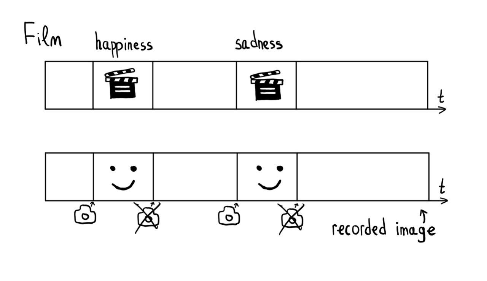
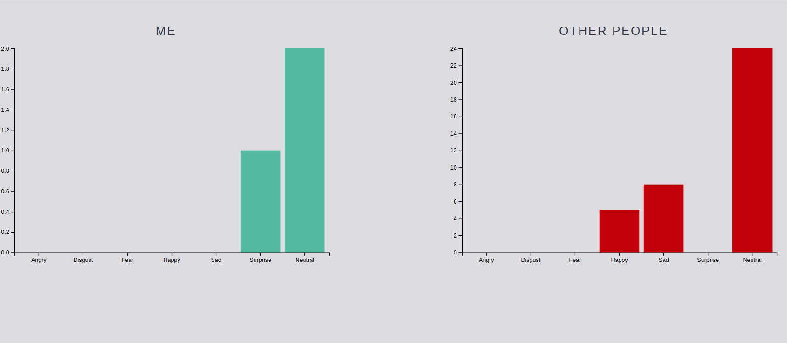

# junction2019
## Problem
There is a problem of mental health among children and young, so early recognition of abnormalities in mental health is very important.
One of the main ways to recognize deviations is to analyze emotions. Emotion has always been a popular research topic, and a large range of procedures have been used to elicit emotions in the laboratory, such as pictures, words, music, imagination, films.

But how to try to conduct a study to parents who are worried about the health of the child, not seeing him immediately to the doctor, exposing stress and not violating his personal space?
 
## Solution
 We propose to conduct a superficial analysis based on family watching movies.

 Compared to these methods the use of emotional films offers several important advantages. 
 * First, unlike slides or still photographs, films involve dynamic auditory, and visual stimuli that are complex and highly capable of capturing attention. 
 * Second, film has a relatively high degree of ecological validity. 
 * Third, films present more realistic emotional context whereby emotions develop over time, and allows researchers to study the time course of an emotion. 
 Films can easily elicit the three main components of emotional responses: the subjective experience, behavior (including facial expression) and physiological responses. A more comprehensive measure of emotional response would include measures of the psychophysiological responses which are primary component of the emotion response.

## Technical details
We based our purposes on psychologists researches on films. They collected samples of films with emotional content from films and video clips from the Internet and created dataset with film-level data matrix film-level analysis was computed in order to provide a means to classify and compare individual films according to specific criteria.

We got timemarks from these samples and start writing in a parallel stream from webcamera to process emotional reactions using neural network and compare with the emotions accumulated from the database.  Main idea is detecting and analyzing abnormal reactions when watching films with parents or some type of self-diagnostic. 

## Future possibilities
Also, we can use additional markers to process emotions as Heart Rate (HR) and Respiration Rate (RR) are currently two of the most common autonomic nervous system markers of emotional processing.

## References
- Schaefer, A., Nils, F., Sanchez, X., & Philippot, P. (2010).
Assessing the effectiveness of a large database of emotion eliciting films: A new tool for emotion researchers. Cognition & Emotion, 24, 1153–1172. doi:10.1080/02699930903274322
- https://www.overleaf.com/read/xvtrrfpvzwhf

## Screens

Main screen

Movie

Face recognition

Results

